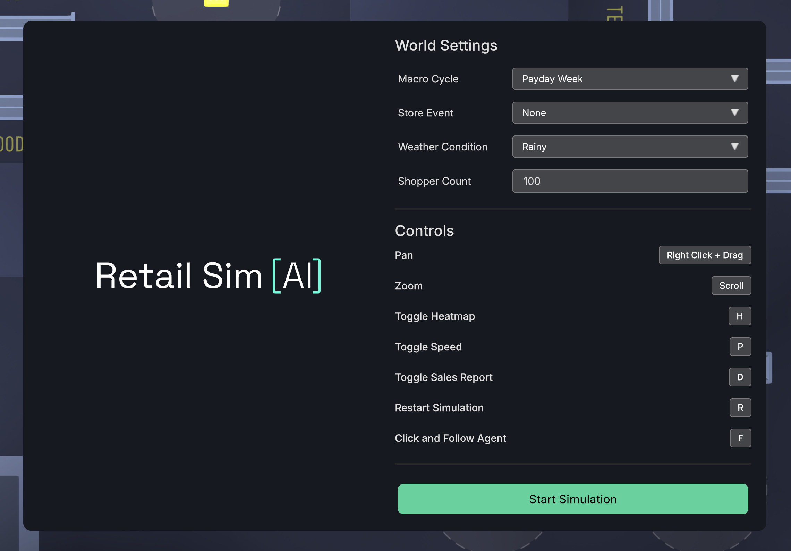
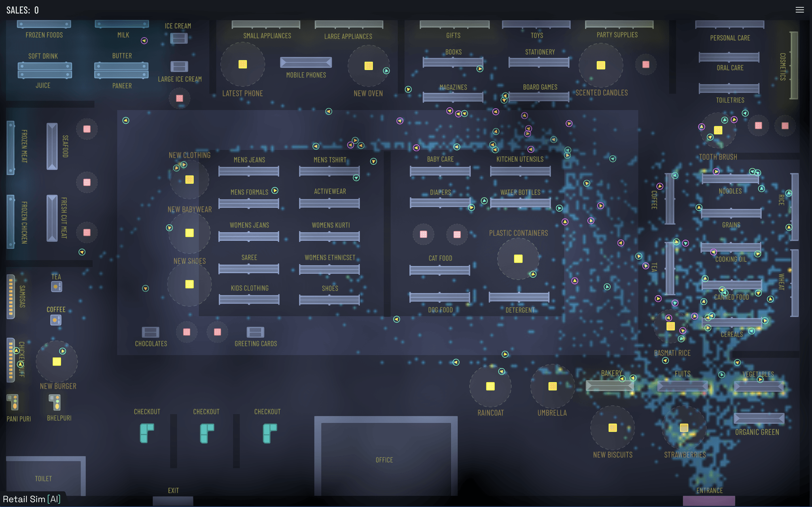
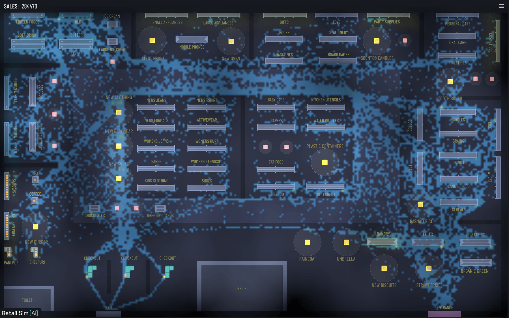
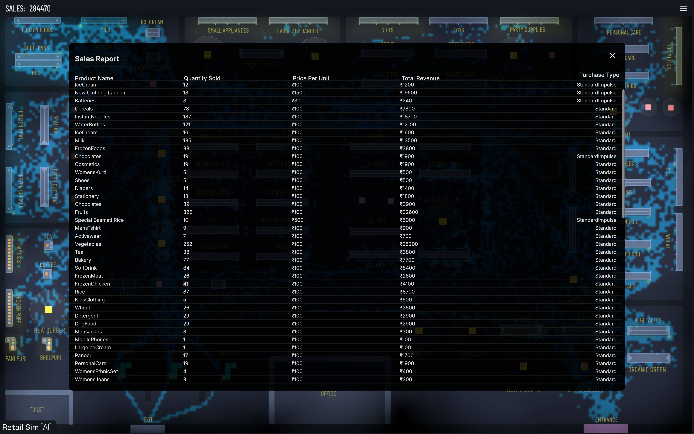
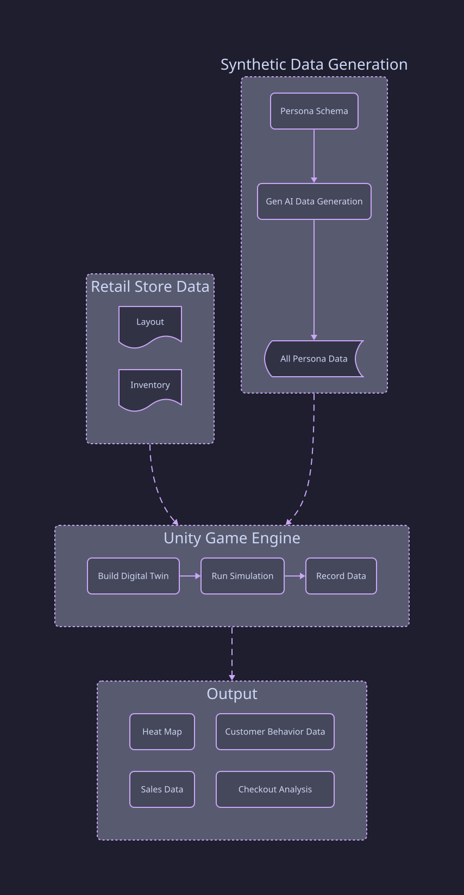

## Introduction

Imagine you want to build a retail store and you want to optimize the layout of the store to maximize sales and customer satisfaction. Well, what do you do? You  hire a team of experts to analyze the store layout and make recommendations. Then, you implement those recommendations, inaugurate the store and start selling your products.
After a few months, you notice that the sales are not as high as expected. You do some research and find out that the layout of the store is not optimal. You decide to hire a team of experts again to analyze the store layout and make recommendations. Then you disassemble the store and rebuild it again.
This results in a lot of wasted time, lost revenue, and frustration for both the store owners and the customers.

## Problem Statement

This is a common problem faced by retail store owners. The layout of the store can have a significant impact on sales and customer satisfaction. However, it is difficult to determine the optimal layout without extensive research and analysis. This can lead to wasted time, lost revenue, and frustration for both the store owners and the customers.

## Solution

The most practical solution is to use a simulation platform that lets store owners visualize and evaluate layouts before making physical changes. Instead of relying on trial and error in the real world, they can test ideas digitally and make decisions backed by data.

Because store planning is highly visual, we use Unity Game Engine to build an interactive digital twin of the retail space. Unity allows us to model shelves, pathways, product placement, and shopper movement in a realistic environment.

With this setup, we can run multiple simulations, compare layout variations, and measure outcomes such as customer flow, dwell time, and purchase conversion. This helps identify the most effective layout for both sales performance and customer experience.

The same approach also supports what-if experiments, such as testing the best position for a new product launch or promotional campaign before moving a single physical shelf. These insights can improve conversion and open new revenue opportunities, including premium pricing for high-visibility placements.

## Demo Video

<iframe
  width="560"
  height="400"
  src="https://www.youtube.com/embed/bLIYAWHUB5U?si=Srbvift6MjWRKUuW"
  title="Store Layout Simulation Demo"
  frameBorder="0"
  allow="accelerometer; autoplay; clipboard-write; encrypted-media; gyroscope; picture-in-picture; web-share"
  referrerPolicy="strict-origin-when-cross-origin"
  allowFullScreen
></iframe>
The playable demo of this project is available on Unity's WebGL platform. You can play the demo in your browser using the link provided in the "Playable Demo" section at the end of this document.

## Features

### World Settings



One can configure the simulation environment with different world settings. This includes setting the time of day, weather conditions, and special events that may affect customer behavior. For example, a rainy day may lead to fewer customers in the store, while a flash sale may increase impulse purchases.

### Heatmap





Using  the simulation data, we can generate real-time heatmaps that show the areas of the store that are most frequently visited by customers. This can help store owners identify high-traffic areas and optimize product placement. This can also help identify areas of the store that are underutilized and may need to be redesigned and prevent bottlenecks in the store layout. The heatmap can also be used to identify areas of the store that are most likely to generate impulse purchases.

### Product Placement Optimization

By analyzing the heatmap data, we can determine the most effective locations for placing products to maximize sales and customer engagement. This includes positioning high-demand items in high-traffic areas and ensuring that products are easily accessible to customers.  
The store owner can also charge a premium for high-visibility placements for new products or seasonal items, which can increase revenue.

### Checkout Congestion Analysis

The simulation can also analyze checkout congestion and identify areas where customers may experience long wait times. This can help store owners optimize the checkout process and improve customer satisfaction. By analyzing the checkout data, we can determine the most effective number of checkout counters to open and the best locations for placing them.

### Sales Analysis



The simulation can also analyze sales data and provide insights into customer purchasing behavior. This includes identifying the most popular products, analyzing sales trends, and determining the effectiveness of promotional campaigns. By analyzing the sales data, we can determine the most effective pricing strategies and promotional tactics to maximize revenue.

## High-Level Architecture Diagram



Let's go in detail about each component of the architecture diagram in detail in following sections.

### 1. Synthetic Data Generation

This component is responsible for generating synthetic data that simulates human behavior in the virtual store. It uses Generative AI to create a set of personas that represent different types of customers, each with their own shopping habits and preferences. This is what drives the virtual shoppers.

_Why do we need synthetic data generation?_

This is a difficult data to collect, but it is important to understand how customers interact with the store layout. We can use Generative AI to simulate human behavior in the virtual store. We will create a set of personas that represent different types of customers, each with their own shopping habits and preferences. These personas will be used to simulate how customers interact with the store layout and make purchasing decisions.

Ideally its possible to collect real data about human behavior in a retail store, but it is difficult and expensive to do so. That is why we went with Persona methodology to generate synthetic data. We can create a set of personas that represent different types of customers, each with their own shopping habits and preferences. These personas can be used to simulate how customers interact with the store layout and make purchasing decisions.

By using personas, we can get average behavior of a group of people, and we can also get insights into how different types of customers behave in the store. This can help us optimize the store layout to maximize sales and customer satisfaction.

If I had to generate Persona data couple of years back, I would have use random data generation techniques or Python libraries like Faker to generate synthetic data. But now, we can use Generative AI to generate synthetic data that is more realistic and accurate. We can use Generative AI to create a set of personas that represent different types of customers, each with their own shopping habits and preferences.

**Code Snippet for Generating Synthetic Data**

Follow is the code snippet to generate synthetic data using Generative AI. The code is written in Python and uses OpenAI's GPT-4o-mini API to generate synthetic data with temperature set to 0.7 to allow for some randomness in the generated data. The code generates 20 personas per archetype to reach a goal of 100 personas.

```python
# 1. Define distinct themes for each loop iteration to force demographic diversity. This ensures that each batch of personas has a unique focus, such as students, professionals, families, etc.
archetypes = [
    "Students and young adults living on a budget, nocturnal habits, love snacks and instant food.",
    "Working professionals and software engineers, high budget, short on time, looking for quick meals or premium items.",
    "Large families and parents shopping for household essentials, bulk quantities, high patience but strict budgets.",
    "Fitness enthusiasts and health-conscious individuals, high preference for fresh veggies, dairy, and structured routines.",
    "Elderly citizens or retired folks, shopping early in the morning, high patience, slower moving, traditional cooking ingredients.",
    "Bargain hunters and deal seekers, low budget, high browsing tendencies, love discounts and promotions.",
    "Impulse buyers and trend followers, high budget, high likelihood of unplanned purchases, easily swayed by attractive displays and new products.",
    "People who are interested in buying clothes, shoes, and accessories, medium budget, fashion-conscious, looking for seasonal trends and stylish items.",
]
```

The above code snippet defines a list of archetypes that represent different types of customers. Each archetype has a unique focus, such as students, professionals, families, etc. The code will generate 20 personas per archetype to reach a goal of 100 personas. This is important because it ensures that the synthetic data is diverse and representative of different types of customers.

```python
personas_per_batch = 20 

# Sample inventory data for the store and food court. This data will be used to generate realistic shopping lists for the personas.
to_eat = """
- Pizza
- Burger
- Sandwich
"""

products = """
- OrganicGreen
- Milk
- Fruits
"""

for i, archetype_focus in enumerate(archetypes):    
    prompt = f"""
    You are generating a batch of {personas_per_batch} distinct customer personas for a 2D supermarket simulation game.

    PRIMARY BATCH FOCUS
    Create personas that primarily match this demographic direction:
    {archetype_focus}

    UNIQUENESS RULES
    - Make names, exact ages, budgets, and shopping lists unique within this batch.
    - Keep each persona distinct in behavior, lifestyle, and purchase intent.

    ROLE
    You are a behavioral data engine for a retail store layout simulator.
    Your job is to generate diverse, hyper-realistic customer personas using explicit demographic context and the provided store inventory.

    INPUT STORE INVENTORY
    {products}

    FOOD COURT INVENTORY
    {to_eat}

    OUTPUT REQUIREMENT
    Generate a single customer profile that strictly conforms to the provided JSON schema.
    All demographics, physics parameters, behavioral attributes, and grocery item lists must feel psychologically realistic and internally consistent.

    GENERATION CONSTRAINTS
    1. ITEM MATCHING
    Every entry item inside "base_shopping_list" and "base_impulse_favorites" must be an exact string match from the provided input store inventory. Add realistic quantities for each item.
    Do not invent items.

    2. LIST EXCLUSION
    Items in "base_shopping_list" must not overlap with or be duplicated inside "base_impulse_favorites".

    3. PHYSICAL REALISM
    Calibrate "baseline_physics" to match the demographics.
    - A "TimeSensitive" professional or student in a rush should have a high base_speed (4.0-4.5) and higher avoidance priority (lower integer values like 25).
    - A "Cautious" or elderly shopper should have a lower base_speed (2.0-2.8) and lower priority (higher integer values like 65).

    4. FINANCIAL REALISM
    Match "base_total_money" to the demographic's "income_level".
    - High income: 15000-20000
    - Low income: 500-2000

    5. PSYCHOLOGICAL PROBABILITY CALIBRATION
    - "base_random_browse_probability" controls detours.
        - If agent_type is "WindowShopper", set this high (0.60 to 0.85).
        - If primary_trait is "TimeSensitive", set this near zero (0.0 to 0.05).
    - "base_impulse_probability" controls unplanned spending.
        - If agent_type is "ImpulseBuyer" or primary_trait is "Impulsive", set this high (0.50 to 0.80).
        - If agent_type is "BargainHunter" or primary_trait is "BudgetConscious", set this very low (0.0 to 0.10).
    6. FOOD COURT INCLUSION
    - Include at least one item from the FOOD COURT INVENTORY in their "base_shopping_list" or "base_impulse_favorites" to make the persona feel more realistic and human.

    TARGET PROFILE DIRECTION
    Create a profile for a [INSERT TARGET DEMOGRAPHIC HERE, e.g., "24-year-old female Software Engineer with a High income who shops quickly after work hours."]
    """
```

Above code snippet defines a prompt that will be used to generate synthetic data using Generative AI. The prompt includes instructions for generating personas that match the demographic direction, uniqueness rules, role, input store inventory, output requirements, and generation constraints. The prompt also includes a target profile direction that specifies the type of persona to be generated.

Following is a sample output of the above code snippet. The output is a JSON object that represents a customer persona.

**Sample Persona Data:**

```json
{
    "persona_name": "Eco-Friendly Shopper",
    "demographics": {
        "age": 38,
        "profession": "Environmental Scientist",
        "income_level": "Medium",
        "gender": "Female"
    },
    "agent_type": "FocusedShopper",
    "primary_trait": "BudgetConscious",
    "baseline_physics": {
        "base_speed": 3.0,
        "base_acceleration": 2.8,
        "base_avoidance_priority": 65
    },
    "base_total_money": 3500,
    "psychological_profile": {
        "base_random_browse_probability": 0.05,
        "base_impulse_probability": 0.07
    },
    "base_shopping_list": [
        "OrganicGreen",
        "Milk",
        "Fruits",
        "CookingOil"
    ],
    "base_impulse_favorites": [
        "IceCream",
        "Stationery"
    ]
}
```

As you can see, the data includes information about the persona's demographics, agent type, primary trait, baseline physics, base total money, psychological profile, base shopping list, and base impulse favorites. This data will be used to simulate the behavior of customers in the virtual store.

### 2. Retail Store Data

This component is responsible for collecting data on the layout and inventory of the store. This data is used to create a virtual representation of the store layout in the simulation tool.
Any retail store owner can provide the layout and inventory data of their store. The layout data includes the placement of shelves, displays, and other fixtures in the store.

### 3. Unity Game Engine

This component is responsible for building the digital twin of the store, running simulations, and recording data on customer behavior, sales, and checkout performance. This is the core of the simulation platform. The Unity Game Engine allows us to create a realistic representation of the store layout and simulate customer behavior in real-time. We will go into more detail in the upcoming sections.

## Simulation Design

### Simulation Parameters

Before starting the simulation, we need to define the parameters of the simulation. As shown in the code snippet above, we have defined three parameters: MacroCycle, StoreEvent, and WeatherCondition. These parameters will be used to simulate different scenarios in the retail store.
Other than these parameters, we can also define other parameters such as the number of customers, the type of customers, and the layout of the store. These parameters will be used to simulate different scenarios in the retail store.
We can also extend the simulation to include other parameters such as the time of day, the day of the week, and the season. These parameters will be used to simulate different scenarios in the retail store.

Each of these parameters affect the behavior of the customers in the store. For example, if it is a payday week, customers are more likely to spend more money. If it is a rainy day, customers are more likely to spend less time in the store. If there is a flash sale, customers are more likely to make impulse purchases.

There is no limit to the number of parameters that can be defined in the simulation. The more parameters that are defined, the more realistic the simulation will be. However, it is important to keep in mind that the more parameters that are defined, the more complex the simulation will be.

### Shopper AI

Each virtual shopper has a fixed shopping list and a set of impulse favorites. The virtual shoppers will make decisions based on their shopping list, impulse favorites, and the parameters defined in the simulation. The virtual shoppers will also make decisions based on their psychological profile. For example, a virtual shopper with a high impulse probability is more likely to make impulse purchases than a virtual shopper with a low impulse probability.

At the start of the simulation, the agent will use pathfinding algorithm like A* powered by Unity  to navigate the store layout. The agent will first check if the items on their shopping list are available in the store. If the items are available, the agent will navigate to the location of the item and add it to their cart. If the items are not available, the agent will skip that item and move on to the next item on their shopping list.

**How Our Shopper AI Thinks ?**

In our Store Simulator, each customer is not just moving randomly. The `AgentMovementEnhanced` logic models a believable shopper that continuously evaluates goals, budget, mood, and environment constraints before deciding what to do next.

This post explains exactly how the agent decides what to buy next, when to detour, and when to head to checkout.

---

### 1) The Agent Runs a State Machine

At the core is a finite state machine:

- `Evaluating`
- `NavigatingToShelf`
- `BrowsingShelf`
- `Wandering`
- `WaitingToQueue`
- `GoingToCheckout`
- `CheckingOut`
- `Leaving`
- `Distracted`

In `Update()`, behavior is state-driven. The most important state is `Evaluating`, where the "brain" runs `CentralizeDecisionMaking()` on a throttled interval (`evaluationInterval`, default 0.2s) instead of every frame.

Why this matters:

- Keeps CPU usage stable with many agents.
- Makes decisions feel intentional instead of twitchy.

---

### 2) The Agent Starts With a Persona

`InitializeWithPersona(...)` injects personality and constraints:

- Planned shopping list (`base_shopping_list`)
- Impulse favorites (`base_impulse_favorites`)
- Budget (`base_total_money` with modifiers)
- Physical behavior (speed/acceleration/avoidance)
- Psychology (impulse and random browsing probabilities)

So two agents in the same store can behave very differently because their traits and modifiers alter:

- how likely they impulse-buy,
- how fast they move,
- and how strict they are with budget pressure.

---

### 3) Decision Pipeline: What Happens in `CentralizeDecisionMaking()`

Every evaluation cycle, the agent follows a layered decision process:

1. **Mood and psychology update**
   - `DynamicMoodEvaluation()` updates fatigue/frustration/patience-driven mood.
   - `ApplyMoodSideEffects()` changes behavior (speed, impulse tendency, list abandonment in impatience).

2. **Hard-stop checks**
   - If shopping list is empty: go to queue holding area.
   - If money is low (&lt;= 20% baseline): stop shopping and go queue.
   - If money is moderately low (&lt;= 40% and &gt; 20%): reduce impulse probability.

3. **Detour roll**
   - Random roll can trigger wandering (`randomBrowseProbability`) if detours remain.
   - This simulates window-shopping and non-linear shopper paths.

4. **Build candidate targets**
   - Planned items are mapped to sections and random slots.
   - Sections recently found "full" are skipped via cooldown.
   - If all are blocked, cooldowns reset as recovery behavior.

5. **Rank nearby options**
   - Uses NavMesh path-length ranking (`FindClosestDestinations`) rather than straight-line distance.
   - Chooses top candidates to reduce wasted walking.

6. **Impulse interception**
   - If impulse condition passes, a favorite impulse item is inserted at the **front** of the queue.
   - Planned route is preserved behind it, so impulse buys feel opportunistic, not chaotic.

7. **Commit to next move**
   - `NavigateToNextCachedTarget()` picks the next valid section and switches to `NavigatingToShelf`.

This sequence gives us a nice balance of realism and performance.

---

### 4) How "What to Buy Next" Is Actually Chosen

The buy-next outcome is not a single random draw. It emerges from:

- **Need-based intent**: planned `shoppingList`
- **Opportunity**: impulse intercepts
- **Reachability**: NavMesh-complete paths only
- **Distance cost**: path-length ranking
- **Inventory friction**: full-shelf cooldown penalties
- **Financial constraints**: affordability and remaining budget
- **Emotional state**: mood impacts pace and impulse behavior

So the next item is effectively the highest-feasibility, highest-urgency target after all constraints are applied.

---

### 5) Shelf Interaction: Browse, Buy, or Skip

When arriving at shelf:

- Agent waits a random browse duration (`2f` to `5f`).
- If item price &lt;= remaining money, purchase succeeds:
  - removes from planned and/or impulse list
  - adds to cart
  - deducts money
- If unaffordable:
  - item is tracked in `CostlyItems`
  - history logs failed purchase intent

This is important because "intent to buy" and "ability to buy" are separate, which creates believable failed purchase stories.

---

### 6) Queue and Checkout Behavior

Once done (or budget-constrained), the agent:

- Moves to holding area.
- Periodically checks for best checkout line (`queueCheckInterval` throttling).
- Joins the least-loaded non-full `CheckoutHandler`.
- Sets avoidance priority based on queue position.

If lines are full, the agent can "shuffle" in holding space, adding natural movement and reducing robotic standing.

---

### 7) Mood Is Not Cosmetic, It Changes Economics

Mood logic drives business-relevant outcomes:

- **Impatient**: moves faster, may abandon planned items (lost sales).
- **Frustrated**: impulse buying can be disabled.
- **Happy**: impulse probability increases.
- **Sad/Fatigued**: emerges with budget stress or costly-item pressure.

This makes emotional simulation directly affect basket size, conversion, and pathing.

---

### 8) Why This Design Works Well

The implementation combines:

- State-machine clarity
- Path-aware ranking
- Cooldown-based contention handling
- Persona-driven variability
- Mood-driven adaptation
- Rich history logging for debugging and analytics

Result: agents feel less like scripted bots and more like shoppers with competing priorities.

---

## Final Thoughts

Although the simulation is not perfect, it provides a good approximation of how customers behave in a retail store. The simulation can be used to test different store layouts and product placements to optimize sales and customer satisfaction. By using synthetic data generation, we can create a diverse set of personas that represent different types of customers, each with their own shopping habits and preferences. This allows us to simulate how customers interact with the store layout and make purchasing decisions.  
For future scope, we can extend the simulation to multi floor stores. Once can easily design the layout of each floor and use Unity's Off-Mesh Link system to simulate the movement of customers between floors. This will allow us to test different layouts and product placements for multi floor stores and optimize sales and customer satisfaction.
We can also incorporate more complex shopper behaviors, and integrate real-time data from actual stores to improve the accuracy of the simulation.

## Playable Demo

This project was built in Unity3D. Unity3D games can be exported on most of the platforms including WebGL. You can play the demo of this project in your browser using the following link.  
[Playable Demo Link](https://play.unity.com/en/games/5c21cd7e-2940-493b-a714-44b2ff292e93/retailsimaiweb)
